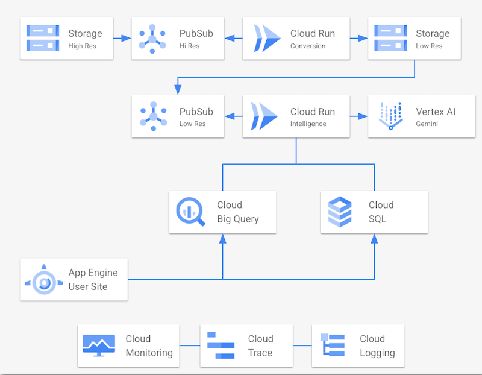

<!--
 Copyright 2024 Google, LLC
 
 Licensed under the Apache License, Version 2.0 (the "License");
 you may not use this file except in compliance with the License.
 You may obtain a copy of the License at
 
     https://www.apache.org/licenses/LICENSE-2.0
 
 Unless required by applicable law or agreed to in writing, software
 distributed under the License is distributed on an "AS IS" BASIS,
 WITHOUT WARRANTIES OR CONDITIONS OF ANY KIND, either express or implied.
 See the License for the specific language governing permissions and
 limitations under the License.
-->
# Media Metadata Extraction & Search

This project provides a complete solution for processing video files, extracting intelligence using Google's Generative AI, persisting the metadata to BigQuery, and enabling powerful semantic search through a web interface.

## Architecture

The project is composed of four main parts:

1.  **Go Backend API (`/backend/go/server`)**: A Go server built with Gin that exposes a REST API for file uploads and media search. It listens to Cloud Storage events via Pub/Sub to trigger media processing workflows.
1.  **React Frontend (`/frontend/web/ui`)**: A React and Material-UI single-page application for interacting with the backend, searching for media, and viewing results.
1.  **GCP Infrastructure (`/deploy/terraform`)**: Terraform scripts to provision all necessary GCP resources, including GCS buckets, Pub/Sub topics, and BigQuery datasets.
1.  **GCP Infrastructure (`/deploy/scripts`)**: Bash scripts to enable Google Cloud APIs and set up the server VM environment.

The core processing logic uses a **Chain of Responsibility (COR)** pattern, where each step (resizing, summary generation, scene extraction) is an atomic, testable unit of work.



## Getting Started

Follow the **[installation instructions](./install.md)** to setup your environment

## Details

In this section we'll outline more details about different parts of the application and infrastructure.

### Prompts and Settings

- All settings are in `.toml` files and used to configure the backend server
- There are two `.toml` files that include settings
    - `backend/go/configs/.env.local.toml`: This holds setting values that are baked in at installation time. If you want to see the template used for this, look at: `backend/go/configs/example_.env.local.toml`
    - `backend/go/configs/.env.toml`: This is the main settings file that holds all sorts of settings used for model invocation, the prompts used, the system instructions, etc.

### Infrastructure

In this section we'll describe the infrastructure that is installed by Terraform.

#### Compute

Everything runs in a Google Cloud Compute Engine VM named `media-search-server`

You can ssh to this VM by using this command:
    ```
    gcloud compute ssh media-search-server --zone us-central1-b
    ```

- The VM is both set up AND the servers started via the `startup-script` custom metadata value.
    - This script is created from this Terraform template: `deploy/terraform/templates/compute-startup-script.sh.tpl`
    - In the template you'll see `${}` tokens. These are replaced with real values when Terraform runs.
    - This script runs in two modes (explained in detail [in this section](./install.md#media-search-app---what-was-installed)).
        - **First Run**: If the `/var/run/first-boot-setup-complete` lock file is NOT found, we will run scripts to install the codebase and configure it. After installation we will start the servers.
        - **Subsequent Runs**: If the `/var/run/first-boot-setup-complete` lock file is found, then we will ONLY start the servers.

- Files on the VM:
    - `/opt/media-search`: This is where the server code is. This location contains all the files in this repository with some customizations and new files with installation specific settings.
    - `/var/log`: There are 3 log files in here:
        - `media-search-backend.log`: Logs for the backend server. This is the main log to look at as the system does its thing.
        - `media-search-frontend.log`: Logs for the frontend server.
        - `media-search-app.log`: Logs for output during server startup.
    - `/var/run/first-boot-setup-complete`: This is a lock file that tells the VM start up script that the server installation was done.

#### Storage

Two buckets are used to hold our video files (these buckets will be named as per your inputs during installation):

- `my-high-res`: This is used for uploaded high resolution videos that we want to process.
- `my-low-res`: This bucket is used for low resolution proxies that are created by `ffmpeg` and are used in our workflow.

**NOTE:** We also create Pub/Sub topics and subscription to alert us when files are uploaded and moved around the buckets

#### Networking

During installation if you gave us a VPC and subnet, we will use that network for the created infrastructure.

If you didn't provide a VPC and subnet, we will create them for you named:
- `media-search-vpc-auto`: The VPC, created in auto-mode.
- `media-search-vpc-auto`: The subnet. (In auto-mode there are subnets named the same as the VPC in every region)

We also create a firewall rule named: `allow-common` to open these ports to `0.0.0.0/0`:
- 22: ssh
- 80: http
- 443: https
- 3389: Windows Remote Desktop
- 5173: Media Search Frontend

#### BigQuery

We create a dataset in BQ named: `media_ds`. This holds all the metadata and embeddings we generate.
